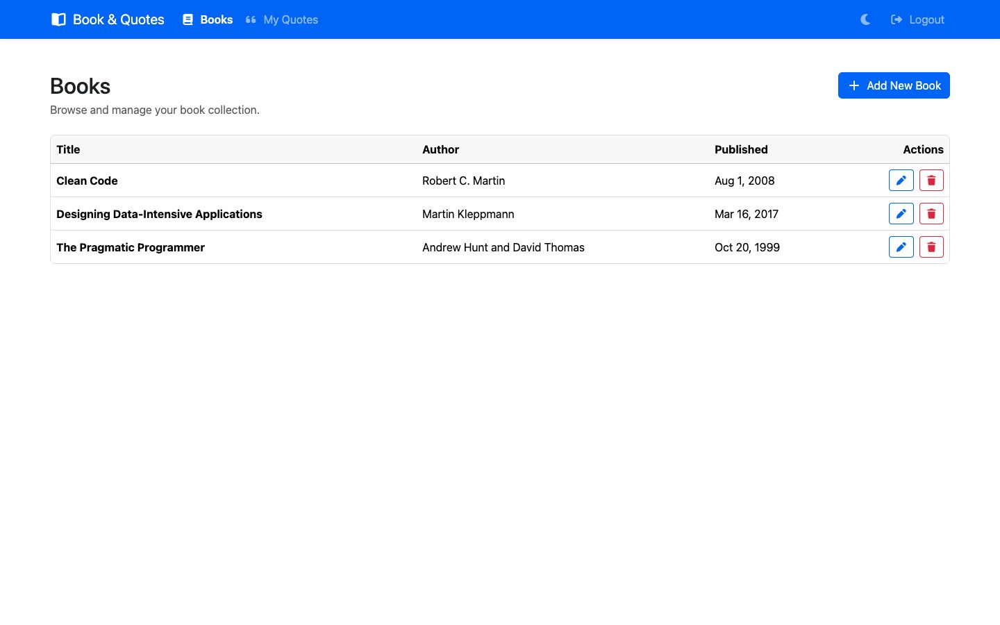
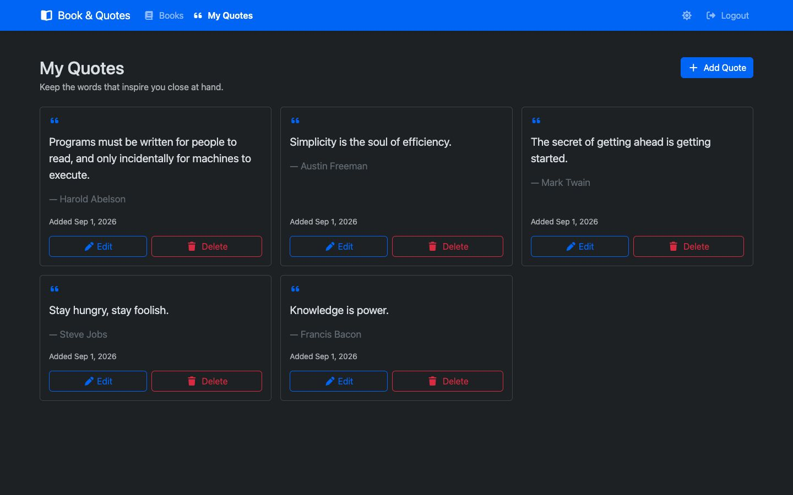
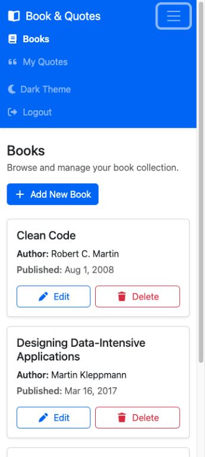
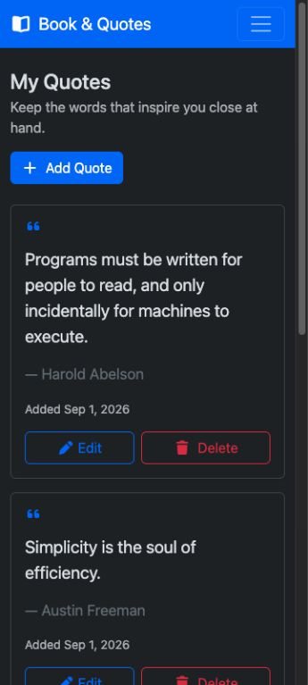

# Book & Quotes

Book & Quotes is a complete responsive CRUD application built with Angular 20 and an ASP.NET Core
9 Web API. Users can register, log in with JWT authentication, manage a shared book collection, and
manage a private collection of favorite quotes. Each new account starts with five quotes.

## Features

- Register and log in with ASP.NET Core Identity and signed JSON Web Tokens.
- Protect every Books and Quotes CRUD endpoint with JWT Bearer authentication.
- Create, read, update, and delete books with validated titles, authors, and publication dates.
- Create, read, update, and delete user-owned quotes; users cannot read or change another user's
  quotes.
- Start every new account with five favorite quotes in one database transaction.
- Use responsive desktop tables, mobile cards, and a collapsible keyboard-accessible navigation
  menu.
- Switch between persistent light and dark themes.
- Use Bootstrap 5.3 and Font Awesome throughout the interface.
- Provide loading, empty, error, success, validation, and confirmation states.
- Verify the system with backend integration tests, Angular unit tests, responsive Playwright tests,
  and GitHub Actions.

## Screenshots

| Desktop light theme | Desktop dark theme |
| --- | --- |
|  |  |

| Mobile light theme and expanded menu | Mobile dark theme |
| --- | --- |
|  |  |

## Technology

| Layer | Technology |
| --- | --- |
| Client | Angular 20, TypeScript, RxJS, standalone components, Reactive Forms |
| UI | Bootstrap 5.3, Font Awesome 7, responsive SCSS |
| API | ASP.NET Core 9 controllers, OpenAPI, Problem Details |
| Authentication | ASP.NET Core Identity, JWT Bearer authentication |
| Persistence | Entity Framework Core 9, SQLite, migrations |
| Testing | xUnit, `WebApplicationFactory`, Angular/Karma/Jasmine, Playwright |
| Automation | GitHub Actions on `main` and pull requests |

## Architecture

```text
Angular pages
  ├─ Reactive Forms and responsive Bootstrap views
  ├─ AuthService, BookService, QuoteService, ThemeService
  ├─ route guard
  └─ origin-restricted JWT interceptor
           │ JSON over HTTP
           ▼
ASP.NET Core API
  ├─ AuthController
  ├─ BooksController
  ├─ QuotesController (scoped to the JWT subject)
  ├─ Identity and JWT validation
  └─ ApplicationDbContext
           │ EF Core
           ▼
         SQLite
```

The client uses lazy-loaded standalone pages. The API uses controllers and request/response
contracts rather than exposing database entities. EF Core migrations create the Identity, Books,
and Quotes tables. The API applies pending migrations and seeds three books at startup when the
Books table is empty.

## Repository structure

```text
.
├── .github/workflows/ci.yml             CI build and test pipeline
├── client/
│   ├── e2e/                             Playwright full-system tests
│   ├── src/app/core/                    Authentication and theme services
│   ├── src/app/features/                Auth, Books, and Quotes pages
│   └── playwright.config.ts
├── docs/
│   ├── issues/                          Implemented project backlog
│   ├── screenshots/                     Desktop/mobile theme captures
│   └── testing.md                       Test commands and device matrix
├── server/
│   ├── BookQuotes.Api/                  ASP.NET Core API
│   ├── BookQuotes.Api.Tests/            Unit and integration tests
│   └── BookQuotes.sln
├── global.json                          .NET SDK policy
└── README.md
```

## Prerequisites

- Git.
- .NET 9 SDK. `global.json` permits roll-forward to the latest installed .NET 9 feature band.
- Node.js `^20.19.0`, `^22.12.0`, or `^24.0.0`.
- npm (included with Node.js).
- Google Chrome for Angular's default headless unit-test launcher.
- Playwright Chromium for end-to-end tests; the install command is below.

## Clean-checkout setup

Clone the repository and restore locked dependencies:

```bash
git clone https://github.com/haochen8/crud-app-redcode.git
cd crud-app-redcode

dotnet restore server/BookQuotes.sln

cd client
npm ci
cd ..
```

The API deliberately contains no JWT signing key. Configure a local development secret once. The
value must contain at least 32 characters and must not be committed:

```bash
dotnet user-secrets set "Jwt:Key" "replace-with-a-random-value-of-at-least-32-characters" \
  --project server/BookQuotes.Api
```

For CI or deployed environments, provide the equivalent environment variable through the platform's
secret store:

```text
Jwt__Key=<secret value containing at least 32 characters>
```

## Run locally

Start the API from the repository root in the first terminal:

```bash
dotnet run --project server/BookQuotes.Api --launch-profile http
```

The API listens on `http://localhost:5047`. In Development, these public diagnostics are available:

- Health: `http://localhost:5047/health`
- OpenAPI: `http://localhost:5047/openapi/v1.json`

Start Angular in a second terminal:

```bash
cd client
npm start
```

Open `http://localhost:4200`, create an account, and log in. Registration creates five starter
quotes for the new user. The default development CORS policy permits this Angular origin.

Development builds call `http://localhost:5047/api`; production builds call
`https://localhost:7047/api`. The values are defined in `client/src/environments/`.

## Authentication and JWT flow

1. `POST /api/auth/register` creates an Identity user and five owned starter quotes in a
   transaction.
2. `POST /api/auth/login` verifies the password and returns an access token, its expiration time,
   and the user summary.
3. Angular stores that session in `localStorage` so a browser refresh preserves the login.
4. The interceptor adds `Authorization: Bearer <token>` only when a request targets the configured
   API origin and path. It never sends the token to third-party or lookalike URLs.
5. The API validates the token signature, issuer, audience, subject claim, and expiry with no clock
   skew.
6. An API `401 Unauthorized` clears the client session and redirects to login. Guards preserve the
   requested URL for a successful return after login.

### localStorage security limitation

`localStorage` is appropriate for this learning project, but any JavaScript running in the page can
read it. A cross-site scripting vulnerability could therefore expose the JWT. A production system
should prefer a server-issued `Secure`, `HttpOnly`, and appropriate `SameSite` cookie, together with
CSRF protection, strict input/output handling, and a Content Security Policy.

## API routes

All request and response bodies use JSON. Routes marked **Protected** require a valid Bearer token.

| Method | Route | Access | Result |
| --- | --- | --- | --- |
| `GET` | `/health` | Public | API health status |
| `GET` | `/openapi/v1.json` | Public in Development | OpenAPI document |
| `POST` | `/api/auth/register` | Public | Create a user and five quotes; `201` |
| `POST` | `/api/auth/login` | Public | Return JWT session; `200` or `401` |
| `GET` | `/api/books` | Protected | List books; `200` |
| `GET` | `/api/books/{id}` | Protected | Read one book; `200` or `404` |
| `POST` | `/api/books` | Protected | Create a book; `201` or `400` |
| `PUT` | `/api/books/{id}` | Protected | Update a book; `200`, `400`, or `404` |
| `DELETE` | `/api/books/{id}` | Protected | Delete a book; `204` or `404` |
| `GET` | `/api/quotes` | Protected | List the current user's quotes; `200` |
| `GET` | `/api/quotes/{id}` | Protected | Read an owned quote; `200` or `404` |
| `POST` | `/api/quotes` | Protected | Create an owned quote; `201` or `400` |
| `PUT` | `/api/quotes/{id}` | Protected | Update an owned quote; `200`, `400`, or `404` |
| `DELETE` | `/api/quotes/{id}` | Protected | Delete an owned quote; `204` or `404` |

Foreign quote IDs return `404`, just like missing IDs, so the API does not reveal whether another
user owns a record. Validation and registration failures use Problem Details responses with field
errors and a trace ID.

Example requests are available in
[`server/BookQuotes.Api/BookQuotes.Api.http`](server/BookQuotes.Api/BookQuotes.Api.http).

## Database and migrations

The default connection is SQLite with `Data Source=bookquotes.db`. On startup the API calls
`MigrateAsync`, so a clean database is created automatically from committed migrations.

Restore the repository-local EF tool and create a new migration after changing the model:

```bash
dotnet tool restore
dotnet tool run dotnet-ef migrations add <MigrationName> \
  --project server/BookQuotes.Api \
  --startup-project server/BookQuotes.Api \
  --output-dir Data/Migrations
```

Inspect pending migrations or update the database manually:

```bash
dotnet tool run dotnet-ef migrations list \
  --project server/BookQuotes.Api \
  --startup-project server/BookQuotes.Api

dotnet tool run dotnet-ef database update \
  --project server/BookQuotes.Api \
  --startup-project server/BookQuotes.Api
```

To reset local data, stop the API and delete `bookquotes.db` plus any `bookquotes.db-shm` and
`bookquotes.db-wal` companions from the API working directory. The next start recreates the schema,
adds the three seed books, and contains no users until registration. This is destructive and should
only be used for disposable local data.

To use a different location or database, override `ConnectionStrings__DefaultConnection` without
editing committed settings.

## Build and test

Run the backend build and its 24 tests:

```bash
dotnet restore server/BookQuotes.sln
dotnet build server/BookQuotes.sln --configuration Release --no-restore
dotnet test server/BookQuotes.sln --configuration Release --no-build
```

Run the Angular production build and its 43 unit tests without a backend:

```bash
cd client
npm ci
npm run build
npm test -- --watch=false --browsers=ChromeHeadless
```

Install the Playwright browser once and run the three isolated full-system journeys:

```bash
cd client
npx playwright install chromium
npm run test:e2e
```

Playwright automatically starts both applications, recreates `.e2e-data/book-quotes.db`, runs one
desktop and one mobile Chromium project, and stops the processes. See
[`docs/testing.md`](docs/testing.md) for headed mode and the manual browser/device matrix.

GitHub Actions repeats the backend, frontend, and E2E checks on every pull request and push to
`main`. Browser reports and backend test results are retained as workflow artifacts when useful.

## Requirement verification

| Requirement | Implementation | Verification |
| --- | --- | --- |
| Books list and add/edit/delete flows | Protected Books API, `BookService`, responsive list and Reactive Form pages | API integration tests, Angular service/page tests, Playwright Books journey |
| Registration, login, JWT storage and logout | Identity, JWT service, `AuthService`, guard and origin-filtered interceptor | Positive/negative API auth tests, eight auth security unit tests, Playwright auth journey |
| Authenticated CRUD only | Fallback authorization policy plus controller authorization | Missing/manipulated/expired-token integration tests |
| Five editable personal quotes | Transactional starter catalog, subject-scoped Quotes API, My Quotes page | Ownership integration tests, quote service/page unit tests, Playwright Quotes journey |
| Responsive navigation and UI | Bootstrap breakpoints, mobile cards, collapsible menu, wrapping actions | 360/768/1024/1440 checks, Playwright mobile project, documented manual matrix |
| Accessible interaction | Landmarks, labels, heading hierarchy, skip link, focus-visible styles, live feedback | Component tests, keyboard/browser review, light/dark contrast review |
| Bootstrap and Font Awesome | Global Bootstrap and Font Awesome packages and component classes/icons | Production build, component icon test, desktop/mobile screenshots |
| Light and dark mode | Persistent `ThemeService` and Bootstrap `data-bs-theme` integration | Theme unit tests, Playwright persistence test, light/dark screenshots |
| Cross-browser/device confidence | Automated Chromium smoke coverage and manual release matrix | `npm run test:e2e` and `docs/testing.md` checklist |
| Reproducible delivery | Locked dependencies, migrations, ignored data/secrets/output, CI workflow | Clean-install builds/tests and GitHub Actions |

## Generated and sensitive files

The repository intentionally excludes local databases and journals, user data, `node_modules`,
build output, test results, coverage, environment files, certificates, private keys, and local app
settings. Never commit JWT keys or real credentials. The signing values used by integration and E2E
tests are explicitly test-only and run with isolated databases.

## Project language and backlog

Source code, UI text, documentation, commits, and GitHub issues use English. The completed,
GitHub-ready implementation backlog remains available in [`docs/issues/README.md`](docs/issues/README.md).
